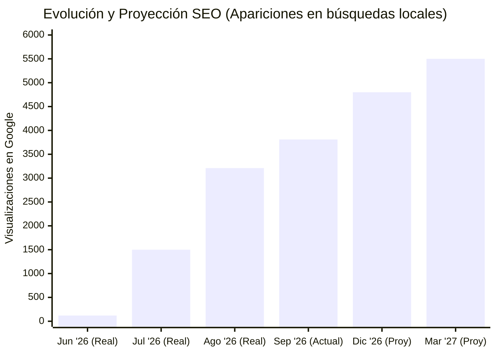

# Evolución y Plan Estratégico Digital: Reparaciones Manzanares

**Fecha:** Septiembre 2026
**Objetivo:** Consolidar el canal de captación digital en la Sierra de Madrid, priorizando proyectos de alto margen (Reformas Integrales) y optimizando el servicio de entrada (Urgencias).

---

## 1. Evolución del Proyecto y Proyección

En apenas 3 meses de indexación, la plataforma ha despegado exponencialmente. Hemos pasado de una web estática a un activo digital de **más de 180 páginas locales indexadas**.

A continuación se muestra la curva real de crecimiento de visibilidad (impresiones en Google) y una proyección conservadora a 6-12 meses basada en la maduración natural del SEO y las nuevas acciones a implementar.

### Proyección de Leads (Estimación Prudente)
Con el crecimiento de la visibilidad, los contactos crecerán de forma proporcional, siempre que apoyemos la web con reseñas reales de clientes:

| Métrica | Situación Actual (Sept 2026) | Proyección a 6 Meses (Marzo 2027) |
| :--- | :--- | :--- |
| **Llamadas comerciales** | ~15-20 / mes | **30-45 / mes** |
| **Solicitudes de Reforma** | 1-2 / mes | **4-8 / mes** |
| **Posición Media Google** | Página 3 (Pos. 27) | **Página 1-2 (Pos. 8-15)** |

---

## 2. El Embudo de Negocio (La Estrategia Real)

El negocio digital no se trata de elegir entre urgencias o reformas, sino de entender cómo funciona el cliente:

1.  **Urgencias (El gancho):** El ticket es bajo (150€), pero es la puerta de entrada. Un cliente que atendemos bien por una fuga un sábado, es un cliente que en 8 meses nos llama para la reforma de su baño sin pedir presupuestos a la competencia. **No podemos perder estos leads.**
2.  **Reformas Integrales (El core business):** El ticket alto (3.000€ - 5.000€+). Todo el contenido actual de la web se ha modificado esta semana para empujar con máxima prioridad la captación de estas obras.
3.  **Servicios Premium (El futuro):** Nichos sin competencia local (Gas Radón, Cerramientos de PVC).

---

## 3. Lo que necesitamos HOY para saltar a la Página 1

Actualmente la gente nos busca, Google nos muestra, pero necesitamos dar el salto a las primeras posiciones. Para ello, necesitamos acciones del mundo real:

### A. Reseñas de Google (Prioridad Máxima)
Tenemos 4 reseñas de 5 estrellas. Necesitamos llegar a **15-20 reseñas reales**.
*   **Acción:** Contactar a 5-10 clientes de confianza recientes y pedirles que dejen una reseña **mencionando específicamente qué reforma se hizo y en qué pueblo**. (Ej: *"Me hicieron la reforma del baño en Alpedrete..."*).

### B. Autoridad (Backlinks)
*   **Acción:** Dar de alta a la empresa en asociaciones de comerciantes locales de la sierra, o solicitar enlaces a proveedores habituales.

### C. Horarios Claros y Reales
*   **Acción:** Para evitar reseñas negativas, debemos definir un sistema de guardia real para urgencias (solo inundaciones/averías graves fuera de horario) o ajustar el horario de la ficha de Google a la realidad comercial (L-V 9:30-20:00).

---

## 4. Operativa de Recepción de Llamadas (Sistema Zadarma)

Para mantener el control y la transparencia total sobre los leads generados por la web, utilizaremos una centralita virtual (Zadarma). El proceso funciona de forma totalmente transparente para el cliente final y para nosotros:

1. **Número Público:** En la web y en Google aparece un número fijo/móvil virtual exclusivo para captación digital (actualmente el *919 93 09 63*).
2. **Desvío Automático:** Cuando el cliente llama a ese número, la centralita desvía la llamada de forma inmediata (en milisegundos) al **teléfono móvil real del profesional**.
3. **Aviso de Origen (Call Whisper):** Al descolgar el teléfono, el profesional escuchará una breve locución automática (ej: *"Llamada desde la web"*) justo antes de que se conecte con el cliente. Así sabremos al 100% que ese cliente viene del SEO.
4. **Registro:** Todas las llamadas (atendidas y perdidas) quedan registradas en un panel para que no se pierda ningún cliente potencial.

**Qué necesitamos proceder hoy:**
* Confirmar el **número de teléfono móvil final** al que se van a desviar las llamadas de la web.
* Compromiso de devolver las llamadas perdidas de este número en la mayor brevedad posible para maximizar la conversión.

---

## 5. Expansión y Acuerdo de Trabajo

### Nuevas Líneas de Negocio (En desarrollo)
1.  **Gas Radón:** Búsquedas semanales en la sierra sin competencia local. Ticket de 1.000€ - 2.500€. Buscando subcontratista certificado.
2.  **Cerramientos PVC:** Altamente demandado por clientes de reformas (Ticket de 8.000€+).

### Trazabilidad y Acuerdo Económico
*   **Transparencia:** Cada presupuesto de reforma cerrado que provenga del aviso de llamada de la web debe ser notificado por WhatsApp para llevar el recuento transparente del 5%.
*   **Visión a futuro:** El objetivo es que, en el plazo de 6 a 12 meses, el volumen de obras justificará migrar del modelo a comisión a una **tarifa plana mensual**, dando estabilidad absoluta a ambos.
